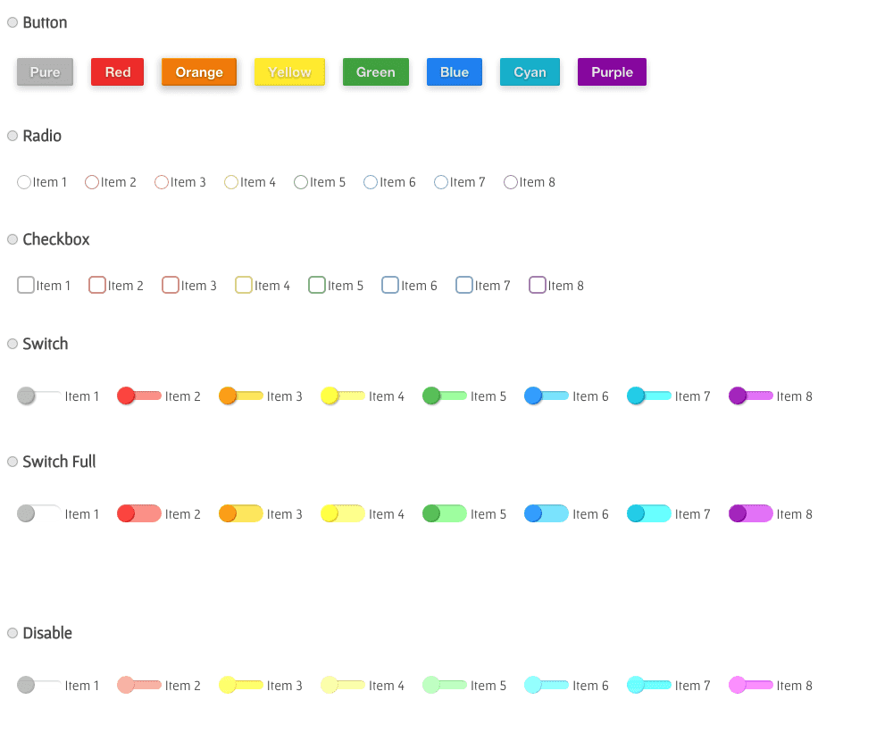

# Welcome To OA's material!
Material 風格的 UI 設計。 這是一個藉由 Compass、HTML 以及 jQuery.. 工具實作的 Material UI Design for Web。 開發者可使用 scss 或者 css 來套用，並且選擇使用 jQuery 來達到更多 UI 回饋效果。

---

 
## 聲明
本作品授權採用 姓名標示-非商業性 2.0 台灣 (CC BY-NC 2.0 TW) 授權，詳見 [http://creativecommons.org/licenses/by-nc/2.0/tw/](http://creativecommons.org/licenses/by-nc/2.0/tw/)

 
## DEMO
* Demo 範例頁面會有詳細解說: [http://comdan66.github.io/OA-material/](http://comdan66.github.io/OA-material/)

 
## 簡介
* 這是一個藉由 [Compass](http://compass-style.org/)、[css](https://zh.wikipedia.org/zh-tw/css) 以及 [jQuery](https://jquery.com/).. 等工具實作的 Material UI Design for Web。。  

* 開發者可使用 **scss** 或者 **css** 來套用，並且選擇使用 jQuery 來達到更多 UI 回饋效果。

* 此 Repository 開發工具主要使用 [Gulp](http://gulpjs.com/)、[Compass](http://compass-style.org/) 以及 [jQuery](https://jquery.com/) 語言所建立，主要架構則使用 [OAF2E v1.2](https://github.com/comdan66/oaf2e/)。

* 相關概念也參考了 [Tedshd's GitHub](https://github.com/tedshd/) 所設計的 [material_design_for_web](https://github.com/tedshd/material_design_for_web)。

* * 資料夾 lib 內包含了 [_oa-material.scss](https://github.com/comdan66/OA-material/blob/master/lib/_oa-material.scss)、[oa.material.css](https://github.com/comdan66/OA-material/blob/master/lib/oa.material.css)、[oa.material.min.css](https://github.com/comdan66/OA-material/blob/master/lib/oa.material.min.css)，三隻檔案提供了 scss、css 兩種使用方式的檔案。

* Demo 範例頁面: [http://comdan66.github.io/OA-material/index.html](http://comdan66.github.io/OA-material/index.html)

 
## 關於
* 作者名稱 - [OA Wu](http://www.ioa.tw/)

* E-mail - <comdan66@gmail.com>

* 作品名稱 - OA-material

* 最新版本 - 2.0.0

* GitHub - [OA-material](https://github.com/comdan66/OA-material)

* Reference - [jQuery](https://jquery.com/)

* Reference - [Compass](http://compass-style.org/)

* Reference - [Tedshd's GitHub](https://github.com/tedshd/material_design_for_web)

* 更新日期 - 2015/08/14